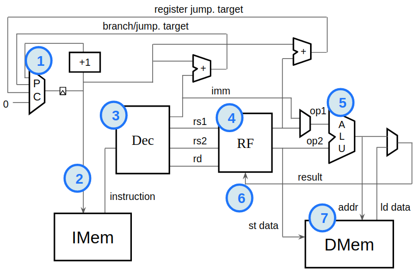

# RISC-V RV32I CPU Core

A 32-bit RISC-V RV32I processor core implemented in Transaction-Level Verilog (TL-Verilog). This implementation supports the complete RV32I instruction set and demonstrates fundamental processor design concepts through a single-cycle architecture.

## Architecture Overview

The processor implements a Harvard architecture with separate instruction and data memory interfaces, enabling concurrent instruction fetch and data access operations.

## Quick Start

1. Open Makerchip IDE
   Visit: https://makerchip.com

2. Load design file
   Copy contents of src/risc-v-cpu.tlv

3. Compile and simulate
   Click "Compile" → "Simulate" → View results in VIZ tab

## Core Specifications

| Component | Specification |
|-----------|---------------|
| ISA | RISC-V RV32I Base Integer |
| Architecture | 32-bit Harvard |
| Register File | 32 × 32-bit (x0 hardwired to 0) |
| Instruction Memory | Read-only, word-addressed |
| Data Memory | 32 words × 32 bits |
| Pipeline | Single-cycle execution |
| ALU Width | 32-bit |

## Instruction Set Support

### Instruction Format Implementation

*[INSERT: RISC-V Instruction Formats - Image 6]*

*[INSERT: Instruction Decoding Tables - Image 4]*
